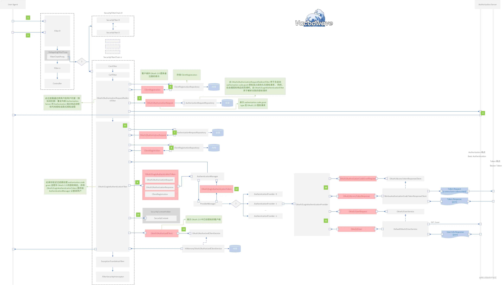

# Examples

https://github.com/MrDexII/spotify-api-integration/blob/ad9e3d448606c281881386b9a324757aa64fadb7/src/main/java/com/andrzej/spotifyapi/controller/HomeController.java
https://github.com/dipankardutta1/Oauth2Client/blob/32544ca79413a76a25d95ab193a6ddb664938bc2/ClientApp2/src/main/java/com/example/demo/config/UiSecurityConfig.java
https://github.com/kruti31/AppId/blob/4ef4ea3182493df9987fd62e80da25508adb6ec1/appid/src/main/java/com/example/appid/SecurityConfiguration.java
https://github.com/chenrujun/spring-security-oauth2-client-sample/blob/843e2d3ee3fce8750cfaefb4e4993d8118e96667/src/main/resources/application.yml
https://github.com/j551234/oauth2_prototype/blob/5f33b88503df6d434c56648bfb4c1d24d5aa7331/src/main/java/com/example/api/OAuth2Controller.java
https://github.com/Dendrocopos-kr/ModumE-Spring-boot/blob/91336844f5cc3fe56a0f6c813c92dc072b0c4fd7/src/main/java/com/amolrang/modume/api/CallApi.java


## Testing

https://github.com/Saljack/spring-security-9477/blob/fa87deb834cfd30945c5870b4ca4ae37ef2617cc/src/test/java/com/saljack/springsecurity9477/SpringSecurity9477ApplicationTests.java

## Spring Security OAuth Client Flow

### Entry-point

[`RegisteredOAuth2AuthorizedClient`](https://github.com/spring-projects/spring-security/blob/main/oauth2/oauth2-client/src/main/java/org/springframework/security/oauth2/client/annotation/RegisteredOAuth2AuthorizedClient.java#L51) annotation.

```java
  @Controller
  public class MyController {
      @GetMapping("/authorized-client")
      public String authorizedClient(@RegisteredOAuth2AuthorizedClient("login-client") OAuth2AuthorizedClient authorizedClient) {
          // do something with authorizedClient
      }
  }
```
### AuthorizeRequest -> Manager.authorize

`RegisteredOAuth2AuthorizedClient` triggers [`OAuth2AuthorizedClientArgumentResolver.resolveArgument`](https://github.com/spring-projects/spring-security/blob/main/oauth2/oauth2-client/src/main/java/org/springframework/security/oauth2/client/web/method/annotation/OAuth2AuthorizedClientArgumentResolver.java#L107).

It creates [`OAuth2AuthorizeRequest`](https://github.com/spring-projects/spring-security/blob/main/oauth2/oauth2-client/src/main/java/org/springframework/security/oauth2/client/OAuth2AuthorizeRequest.java#L42) containing:
- `clientRegistrationId`
- `OAuth2AuthorizedClient` (is `null` in this case)
- `Authentication principal` (`SecurityContextHolder.getContext().getAuthentication()`)
- `HttpServletRequest`
- `HttpServletResponse`

And passes it to [`OAuth2AuthorizedClientManager.authorize(OAuth2AuthorizeRequest authorizeRequest)`](https://github.com/spring-projects/spring-security/blob/main/oauth2/oauth2-client/src/main/java/org/springframework/security/oauth2/client/OAuth2AuthorizedClientManager.java#L66)

Default implementation is [`DefaultOAuth2AuthorizedClientManager`](https://github.com/spring-projects/spring-security/blob/main/oauth2/oauth2-client/src/main/java/org/springframework/security/oauth2/client/web/DefaultOAuth2AuthorizedClientManager.java#L138)

### Manager.authorize -> Provider(s).authorize

The manager is buidling the [`OAuth2AuthorizationContext`](https://github.com/spring-projects/spring-security/blob/main/oauth2/oauth2-client/src/main/java/org/springframework/security/oauth2/client/OAuth2AuthorizationContext.java#L40) containing:
- `ClientRegistration`
- `OAuth2AuthorizedClient` is loaded from [`OAuth2AuthorizedClientRepository.loadAuthorizedClient(String clientRegistrationId, Authentication principal,
			HttpServletRequest request)`](https://github.com/spring-projects/spring-security/blob/main/oauth2/oauth2-client/src/main/java/org/springframework/security/oauth2/client/web/OAuth2AuthorizedClientRepository.java#L57)
- `Authentication principal`
- `HttpServletRequest`
- `HttpServletResponse`

If the client is not authorized yet it calls the chain of [`OAuth2AuthorizedClientProvider.authorize(OAuth2AuthorizationContext context)`](https://github.com/spring-projects/spring-security/blob/main/oauth2/oauth2-client/src/main/java/org/springframework/security/oauth2/client/OAuth2AuthorizedClientProvider.java#L50)

The chain can contain the following providers:
- [`AuthorizationCodeOAuth2AuthorizedClientProvider`](https://github.com/spring-projects/spring-security/blob/main/oauth2/oauth2-client/src/main/java/org/springframework/security/oauth2/client/AuthorizationCodeOAuth2AuthorizedClientProvider.java#L33). This throws [`ClientAuthorizationRequiredException`](https://github.com/spring-projects/spring-security/blob/main/oauth2/oauth2-client/src/main/java/org/springframework/security/oauth2/client/ClientAuthorizationRequiredException.java#L29) if the client is not authorized.
- [`RefreshTokenOAuth2AuthorizedClientProvider`](https://github.com/spring-projects/spring-security/blob/main/oauth2/oauth2-client/src/main/java/org/springframework/security/oauth2/client/RefreshTokenOAuth2AuthorizedClientProvider.java#L76). This is responsible for requesting new access token using refresh token after access token has expired (or expires in one minute).

### Succesful client authorization

In case of success [`OAuth2AuthorizationSuccessHandler.onAuthorizationSuccess(OAuth2AuthorizedClient authorizedClient, Authentication principal, Map<String, Object> attributes)`](https://github.com/spring-projects/spring-security/blob/main/oauth2/oauth2-client/src/main/java/org/springframework/security/oauth2/client/OAuth2AuthorizationSuccessHandler.java#L47) is called.

In default case this calls [`OAuth2AuthorizedClientRepository.saveAuthorizedClient(OAuth2AuthorizedClient authorizedClient, Authentication principal, HttpServletRequest request, HttpServletResponse response)`](https://github.com/spring-projects/spring-security/blob/main/oauth2/oauth2-client/src/main/java/org/springframework/security/oauth2/client/web/OAuth2AuthorizedClientRepository.java#L68)

As last step the authorized client is injected to parameter annotated with `@RegisteredOAuth2AuthorizedClient`.

### Failed client authorization

In case [`OAuth2AuthorizationException`](https://github.com/spring-projects/spring-security/blob/main/oauth2/oauth2-core/src/main/java/org/springframework/security/oauth2/core/OAuth2AuthorizationException.java#L27) is thrown [`OAuth2AuthorizationFailureHandler.onAuthorizationFailure(OAuth2AuthorizationException  authorizationException, Authentication principal, Map<String, Object> attributes)`](https://github.com/spring-projects/spring-security/blob/main/oauth2/oauth2-client/src/main/java/org/springframework/security/oauth2/client/OAuth2AuthorizationFailureHandler.java#L47) is called.

In default case this calls [`OAuth2AuthorizedClientRepository.removeAuthorizedClient(String clientRegistrationId, Authentication principal, HttpServletRequest request, HttpServletResponse response)`](https://github.com/spring-projects/spring-security/blob/main/oauth2/oauth2-client/src/main/java/org/springframework/security/oauth2/client/web/OAuth2AuthorizedClientRepository.java#L79)

The exception is rethrown and catched in [`OAuth2AuthorizationRequestRedirectFilter.doFilterInternal(HttpServletRequest request, HttpServletResponse response, FilterChain filterChain)`](https://github.com/spring-projects/spring-security/blob/main/oauth2/oauth2-client/src/main/java/org/springframework/security/oauth2/client/web/OAuth2AuthorizationRequestRedirectFilter.java#L158)

### Redirection to the Authorization Server's Authorization Endpoint

In case of `ClientAuthorizationRequiredException` `OAuth2AuthorizationRequestRedirectFilter` calls [`OAuth2AuthorizationRequestResolver.resolve(HttpServletRequest request, String clientRegistrationId)`](https://github.com/spring-projects/spring-security/blob/main/oauth2/oauth2-client/src/main/java/org/springframework/security/oauth2/client/web/OAuth2AuthorizationRequestResolver.java#L54).

It creates [`OAuth2AuthorizationRequest`](https://github.com/spring-projects/spring-security/blob/main/oauth2/oauth2-core/src/main/java/org/springframework/security/oauth2/core/endpoint/OAuth2AuthorizationRequest.java#L54) responsible for creating the authorization request url for redirection.

As last step the redirection is made.

### Redirection back to client after End-User (Resource Owner) has granted access

[`AbstractAuthenticationProcessingFilter.doFilterInternal(HttpServletRequest request, HttpServletResponse response, FilterChain filterChain)`](https://github.com/spring-projects/spring-security/blob/main/web/src/main/java/org/springframework/security/web/authentication/AbstractAuthenticationProcessingFilter.java#L219) which calls [`OAuth2LoginAuthenticationFilter.attemptAuthentication(HttpServletRequest request, HttpServletResponse response)`](https://github.com/spring-projects/spring-security/blob/main/oauth2/oauth2-client/src/main/java/org/springframework/security/oauth2/client/web/OAuth2LoginAuthenticationFilter.java#L162)

[`OAuth2AuthorizationResponse`](https://github.com/spring-projects/spring-security/blob/main/oauth2/oauth2-core/src/main/java/org/springframework/security/oauth2/core/endpoint/OAuth2AuthorizationResponse.java#L34) is created containing
- `redirectUri`
- `state`
- `code`
- `error`

Based on this [`OAuth2LoginAuthenticationToken`](https://github.com/spring-projects/spring-security/blob/main/oauth2/oauth2-client/src/main/java/org/springframework/security/oauth2/client/authentication/OAuth2LoginAuthenticationToken.java#L47) is created containing
- `OAuth2User principal`
- `ClientRegistration clientRegistration`
- `OAuth2AuthorizationExchange authorizationExchange` which contains authorization request and response
- `OAuth2AccessToken accessToken` is `null` yet
- `OAuth2RefreshToken refreshToken` is `null` yet


Then [`AuthenticationManager.authenticate(Authentication authentication)`](https://github.com/spring-projects/spring-security/blob/main/core/src/main/java/org/springframework/security/authentication/AuthenticationManager.java#L53) is  called with `OAuth2LoginAuthenticationToken`.

One of the following providers are called
- `AnonymousAuthenticationProvider` not called
- `OAuth2LoginAuthenticationProvider` calls [`OAuth2AuthorizationCodeAuthenticationProvider.authenticate(Authentication authentication)`](https://github.com/spring-projects/spring-security/blob/main/oauth2/oauth2-client/src/main/java/org/springframework/security/oauth2/client/authentication/OAuth2AuthorizationCodeAuthenticationProvider.java#L72)
- `OidcAuthorizationCodeAuthenticationProvider` not called

### Requesting access token

`OAuth2AuthorizationCodeAuthenticationProvider` is checking first if the `state` matches in `authorizationResponse` and `authorizationRequest`.

Then using [`OAuth2AccessTokenResponseClient.getTokenResponse(OAuth2AuthorizationCodeGrantRequest authorizationGrantRequest)`](https://github.com/spring-projects/spring-security/blob/main/oauth2/oauth2-client/src/main/java/org/springframework/security/oauth2/client/endpoint/OAuth2AccessTokenResponseClient.java#L56) requests access token from Authorization Server.

Default implementation is [`DefaultAuthorizationCodeTokenResponseClient`](https://github.com/spring-projects/spring-security/blob/main/oauth2/oauth2-client/src/main/java/org/springframework/security/oauth2/client/endpoint/DefaultAuthorizationCodeTokenResponseClient.java#L74)

### Handling succesful authentication

After succesful authentication using `AuthenticationManager` `OAuth2LoginAuthenticationFilter` creates [`OAuth2AuthorizedClient`](https://github.com/spring-projects/spring-security/blob/main/oauth2/oauth2-client/src/main/java/org/springframework/security/oauth2/client/OAuth2AuthorizedClient.java#L44).

`OAuth2AuthorizedClient` is saves it using [`OAuth2AuthorizedClientRepository.saveAuthorizedClient(OAuth2AuthorizedClient authorizedClient, Authentication principal, HttpServletRequest request, HttpServletResponse response)`](https://github.com/spring-projects/spring-security/blob/main/oauth2/oauth2-client/src/main/java/org/springframework/security/oauth2/client/web/OAuth2AuthorizedClientRepository.java#L68).

Also `OAuth2LoginAuthenticationFilter` creates an [`OAuth2AuthenticationToken`](https://github.com/spring-projects/spring-security/blob/main/oauth2/oauth2-client/src/main/java/org/springframework/security/oauth2/client/authentication/OAuth2AuthenticationToken.java#L44) containing
- `OAuth2User principal`
- `String authorizedClientRegistrationId`

Later `AbstractAuthenticationProcessingFilter` sets the new `OAuth2AuthenticationToken` in `SecurityContextHolder`.

```java
SecurityContext context = SecurityContextHolder.createEmptyContext();
context.setAuthentication(authResult);
SecurityContextHolder.setContext(context);
```

As last step it calls [`SavedRequestAwareAuthenticationSuccessHandler.onAuthenticationSuccess(HttpServletRequest request, HttpServletResponse response, Authentication authentication)`](https://github.com/spring-projects/spring-security/blob/main/web/src/main/java/org/springframework/security/web/authentication/SavedRequestAwareAuthenticationSuccessHandler.java#L73) which does a redirection to original request or to predefined `defaultSuccessUrl` configured in `SecurityFilterChain` `@Bean`. 

```java
http.oauth2Login()
  .defaultSuccessUrl(webConfig.getPublicAppUrl());
```

## Spring Security classes

### @interface RegisteredOAuth2AuthorizedClient

Package: `org.springframework.security.oauth2.client.annotation`

This annotation may be used to resolve a method parameter to an argument value of type `OAuth2AuthorizedClient`.
For example:
```java
  @Controller
  public class MyController {
      @GetMapping("/authorized-client")
      public String authorizedClient(@RegisteredOAuth2AuthorizedClient("login-client") OAuth2AuthorizedClient authorizedClient) {
          // do something with authorizedClient
      }
  }
  ```

### class OAuth2AuthorizedClientArgumentResolver

Package: `org.springframework.security.oauth2.client.web.method.annotation`

An implementation of a `HandlerMethodArgumentResolver` that is capable of resolving a method parameter to an argument value of type `OAuth2AuthorizedClient`.

### class ClientRegistration

Package: `org.springframework.security.oauth2.client.registration`

A representation of a client registration with an OAuth 2.0 or OpenID Connect 1.0 Provider.

### class OAuth2AuthorizedClient

Package: `org.springframework.security.oauth2.client`

A representation of an OAuth 2.0 "Authorized Client".
A client is considered "authorized" when the End-User (Resource Owner) has granted authorization to the client to access it's protected resources.
This class associates the Client to the Access Token granted/authorized by the Resource Owner.

### class OAuth2AuthorizeRequest

Package: `org.springframework.security.oauth2.client`

Represents a request the `OAuth2AuthorizedClientManager` uses to authorize (or re-authorize) the client identified by the provided clientRegistrationId.

### interface OAuth2AuthorizedClientManager

Package: `org.springframework.security.oauth2.client`

Implementations of this interface are responsible for the overall management of Authorized Client(s).
The primary responsibilities include:
Authorizing (or re-authorizing) an OAuth 2.0 Client by leveraging an `OAuth2AuthorizedClientProvider(s)`.
Delegating the persistence of an `OAuth2AuthorizedClient`, typically using an `OAuth2AuthorizedClientService` OR `OAuth2AuthorizedClientRepository`.

### class DefaultOAuth2AuthorizedClientManager

Package: `org.springframework.security.oauth2.client.web`

The default implementation of an `OAuth2AuthorizedClientManager` for use within the context of a `HttpServletRequest`.
(When operating outside of the context of a `HttpServletRequest`, use `AuthorizedClientServiceOAuth2AuthorizedClientManager` instead.)
Authorized Client Persistence
This manager utilizes an `OAuth2AuthorizedClientRepository` to persist `OAuth2AuthorizedClients`.
By default, when an authorization attempt succeeds, the `OAuth2AuthorizedClient` will be saved in the `OAuth2AuthorizedClientRepository`. This functionality can be changed by configuring a custom `OAuth2AuthorizationSuccessHandler` via `setAuthorizationSuccessHandler(OAuth2AuthorizationSuccessHandler)`.
By default, when an authorization attempt fails due to an `"invalid_grant"` error, the previously saved `OAuth2AuthorizedClient` will be removed from the `OAuth2AuthorizedClientRepository`. (The `"invalid_grant"` error can occur when a refresh token that is no longer valid is used to retrieve a new access token.) This functionality can be changed by configuring a custom `OAuth2AuthorizationFailureHandler` via `setAuthorizationFailureHandler(OAuth2AuthorizationFailureHandler)`.

### class OAuth2AuthorizationRequestRedirectFilter

Package: `org.springframework.security.oauth2.client.web`

This Filter initiates the authorization code grant or implicit grant flow by redirecting the End-User's user-agent to the Authorization Server's Authorization Endpoint.
It builds the OAuth 2.0 Authorization Request, which is used as the redirect URI to the Authorization Endpoint. The redirect URI will include the client identifier, requested scope(s), state, response type, and a redirection URI which the authorization server will send the user-agent back to once access is granted (or denied) by the End-User (Resource Owner).
By default, this Filter responds to authorization requests at the URI `/oauth2/authorization/{registrationId}` using the default `OAuth2AuthorizationRequestResolver`. The URI template variable `{registrationId}` represents the registration identifier of the client that is used for initiating the OAuth 2.0 Authorization Request.
The default base URI `/oauth2/authorization` may be overridden via the constructor `OAuth2AuthorizationRequestRedirectFilter(ClientRegistrationRepository, String)`, or alternatively, an `OAuth2AuthorizationRequestResolver` may be provided to the constructor `OAuth2AuthorizationRequestRedirectFilter(OAuth2AuthorizationRequestResolver)` to override the resolving of authorization requests.

### class OAuth2AuthorizationCodeGrantFilter

Package: `org.springframework.security.oauth2.client.web`

A Filter for the OAuth 2.0 Authorization Code Grant, which handles the processing of the OAuth 2.0 Authorization Response.
The OAuth 2.0 Authorization Response is processed as follows:
- Assuming the End-User (Resource Owner) has granted access to the Client, the Authorization Server will append the code and state parameters to the redirect_uri (provided in the Authorization Request) and redirect the End-User's user-agent back to this Filter (the Client).
- This Filter will then create an OAuth2AuthorizationCodeAuthenticationToken with the code received and delegate it to the AuthenticationManager to authenticate.
- Upon a successful authentication, an Authorized Client is created by associating the client to the access token and current Principal and saving it via the `OAuth2AuthorizedClientRepository`.

### interface ClientRegistrationRepository

Package: `org.springframework.security.oauth2.client.registration`

A repository for OAuth 2.0 / OpenID Connect 1.0 ClientRegistration(s).
NOTE: Client registration information is ultimately stored and owned by the associated Authorization Server. Therefore, this repository provides the capability to store a sub-set copy of the primary client registration information externally from the Authorization Server.

### interface OAuth2AuthorizedClientRepository

Package: `org.springframework.security.oauth2.client.web`

Implementations of this interface are responsible for the persistence of Authorized Client(s) between requests.
The primary purpose of an Authorized Client is to associate an Access Token credential to a Client and Resource Owner, who is the Principal that originally granted the authorization.

### interface AuthenticationManager

Package: `org.springframework.security.authentication`

Attempts to authenticate the passed `Authentication` object, returning a fully populated `Authentication` object (including granted authorities) if successful.
An AuthenticationManager must honour the following contract concerning exceptions:
- A `DisabledException` must be thrown if an account is disabled and the `AuthenticationManager` can test for this state.
- A `LockedException` must be thrown if an account is locked and the `AuthenticationManager` can test for account locking.
- A `BadCredentialsException` must be thrown if incorrect credentials are presented. Whilst the above exceptions are optional, an `AuthenticationManager` must always test credentials.
Exceptions should be tested for and if applicable thrown in the order expressed above (i.e. if an account is disabled or locked, the authentication request is immediately rejected and the credentials testing process is not performed). This prevents credentials being tested against disabled or locked accounts.
Params:
authentication – the authentication request object
Returns:
a fully authenticated object including credentials
Throws:
`AuthenticationException` – if authentication fails

### class OAuth2LoginAuthenticationProvider

Package: `org.springframework.security.oauth2.client.authentication`

An implementation of an `AuthenticationProvider` for OAuth 2.0 Login, which leverages the OAuth 2.0 Authorization Code Grant Flow. This AuthenticationProvider is responsible for authenticating an Authorization Code credential with the Authorization Server's Token Endpoint and if valid, exchanging it for an Access Token credential.
It will also obtain the user attributes of the End-User (Resource Owner) from the UserInfo Endpoint using an `OAuth2UserService`, which will create a `Principal` in the form of an `OAuth2User`. The `OAuth2User` is then associated to the `OAuth2LoginAuthenticationToken` to complete the authentication.

### class OAuth2ClientConfigurer

Package: `org.springframework.security.config.annotation.web.configurers.oauth2.client`

An `AbstractHttpConfigurer` for OAuth 2.0 Client support.
The following configuration options are available:
`authorizationCodeGrant()` - support for the OAuth 2.0 Authorization Code Grant
Defaults are provided for all configuration options with the only required configuration being `clientRegistrationRepository(ClientRegistrationRepository)`. Alternatively, a `ClientRegistrationRepository` `@Bean` may be registered instead.

## Flow



### Redirect

1. Resource owner Make a request in the browser `GET` `/oauth2/authorization/{registrationId}`
2. `OAuth2AuthorizationRequestRedirectFilter` takes `registrationId` passes in as a parameter and call `ClientRegistrationRepository` Interface `findByRegistrationId()` method ,`findByRegistrationId()` returns `ClientRegistration`
3. `OAuth2AuthorizationRequestRedirectFilter` according to `ClientRegistration` Generate `OAuth2AuthorizationRequest`, And call `AuthorizationRequestRepository` of `saveAuthorizationRequest()` method is shared across sessions `OAuth2AuthorizationRequest`
4. `OAuth2AuthorizationRequestRedirectFilter` from `ClientRegistration` Generate a URL Send to Authorization Server Of Authorization Endpoint ,Authorization Server Return to login page

### Pre certification processing

1. resource owner Submit user information and send login request on the login page
2. `OAuth2LoginAuthenticationFilter` Analyze requests from Authorization Server Authorization response for , And generate `OAuth2AuthorizationResponse`
3. `OAuth2LoginAuthenticationFilter` calls `AuthorizationRequestRepository` Interface `loadAuthorizationRequest()` How to get `OAuth2AuthorizationRequest`
4. `OAuth2LoginAuthenticationFilter` takes `registrationId` Pass in as a parameter and call `ClientRegistrationRepository` Interface `findByRegistrationId()` Method ,`findByRegistrationId()` returns `ClientRegistration`

### The certification process

1. `OAuth2LoginAuthenticationFilter` generation contains `OAuth2AuthorizationRequest`、`OAuth2AuthorizationResponse` and `ClientRegistration` Of `OAuth2LoginAuthenticationToken`
2. `OAuth2LoginAuthenticationProvider` By calling `OAuth2AccessTokenResponseClient` Interface `getTokenResponse()` Methods from Authorization Server Of Token Endpoint acquisition Access Token
3. `OAuth2LoginAuthenticationProvider` By calling `OAuth2UserService` Interface `loadUser()` Methods from Authorization Server Of Authorization The endpoint obtains user information
4. `OAuth2LoginAuthenticationProvider` Generate `OAuth2LoginAuthenticationToken` Return the authentication result

### Post certification processing

1. `OAuth2LoginAuthenticationFilter` Generate according to the authentication results `OAuth2AnthenticationToken` And set it in `SecurityContext` in
2. `OAuth2LoginAuthenticationFilter` Generate according to the authentication results `OAuth2AuthorizedClient` , call `OAuth2AuthorizedClientService` Of `saveAuthorizedClinet()` Method , take `OAuth2AuthorizedClient` Save in an area accessible to any class
